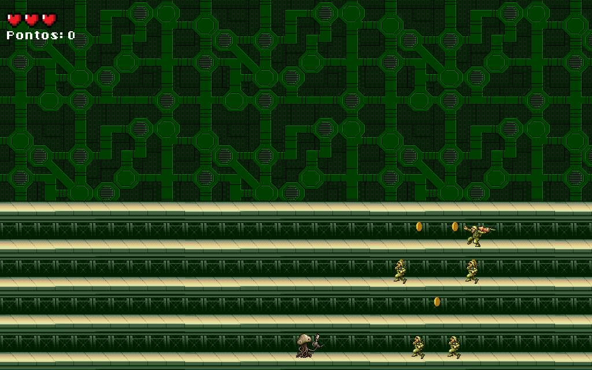

# allegro-game
Final project of the C programming language course at IFSC (2016/2)



## Requirements

Install the allegro library (Ubuntu):

```bash
apt install liballegro5-dev
```

## Usage

Compile the game:

```bash
cd src; make
```

Open the game:

```bash
./main
```
